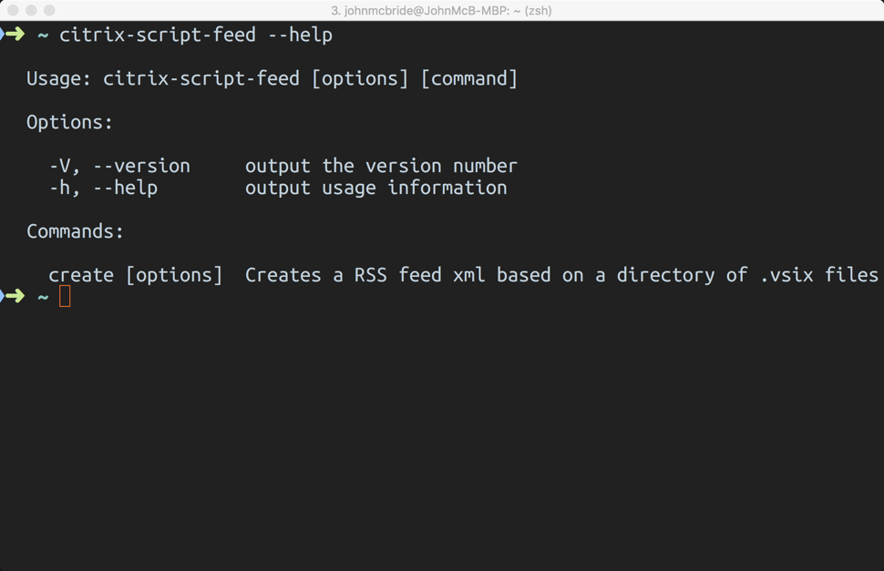
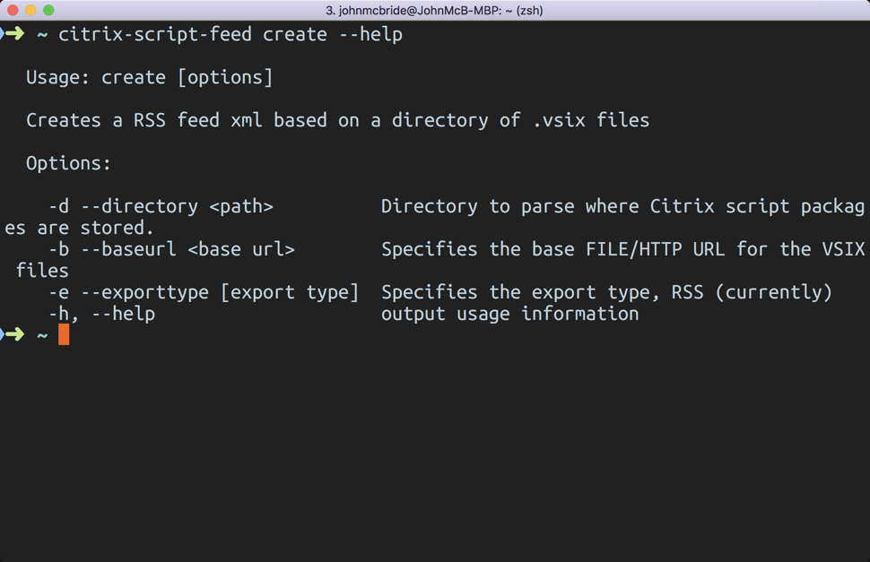

# citrix-script-feed-gen

A command line tool helps you build a rss feed from a directory containing Citrix script packages

## Description

This global tool is used to create an RSS feed based on a directory that has one or mamy Citrix script packages in it. You can host the RSS feed on either a fileshare or on a webserver. In order to create these script package please check out the citrix-script-packager tool [located here](https://github.com/citrix/citrix-script-packager)

## Installation

We distribute this tool using npm. To install this in your environment, execute the following command

```sh
npm install -g citrix-script-feed
```

## Usage

To get the CLI commands help, execute

```sh
citrix-script-feed --help
```



Currently there is one command available to execute called "create". To get the help for the create command and parameters execute the following.

```sh
citrix-script-feed create --help
```



### Parameters

#### -- directory (-d)

* This parameter allows you to specify where to look for the .vsix files to help build up the RSS feed. The tool will traverse the directory you specific and look at each .vsix file and try to add it to an \<item> element in the RSS feed.

#### -- baseurl (-b)

* This parameter specifies the base URL that the vsix files will be available for download at. This could be a file:// path for internal file shares or can be a HTTP based path for files hosted on a web server.

* Examples

    * -b file:///share/scriptpackages
    * -b http<span></span>://www.myserver.com/mypackages

#### -- exporttype (-e)

* This parameter specifies what feed type you would like to output. Currently the only option here is RSS.

## Getting started

Once you have this global tool installed, you can get started generating an RSS feed to use within the [Citrix Developer Extension for Visual Studio Code](https://marketplace.visualstudio.com/items?itemName=CitrixDeveloper.citrixdeveloper-vscode).

Make sure you have you Citrix script packages located in a single directory somewhere where you can access them.

Run the global tool like this, subsituting **< >** with you own locations.

```sh
citrix-script-feed -d <path to script packages> -b file://<mypath> -e RSS
```

Once you execute this command you will find a feed.rss in the directory from which you execute the tool.

Once you have the feed created you will need to add the feed into the Citrix Developer Extension for Visual Studio Code.

## Video tutorial

[](https://www.youtube.com/watch?v=DZ4CcWIyT-Y)


## Contributing

Please read [CONTRIBUTING.md](https://gist.github.com/PurpleBooth/b24679402957c63ec426) for details on our code of conduct, and the process for submitting pull requests to us.

## Versioning

We use [SemVer](http://semver.org/) for versioning. For the versions available, see the [tags on this repository](https://github.com/your/project/tags).

## Authors

* **John McBride** - *Initial work* - [github: johnmcbride](https://github.com/johnmcbride)
[Twitter: johnmcbride](http://twitter.com/johnmcbride)

## License

This project is licensed under the MIT License - see the [LICENSE.md](LICENSE.md) file for details
